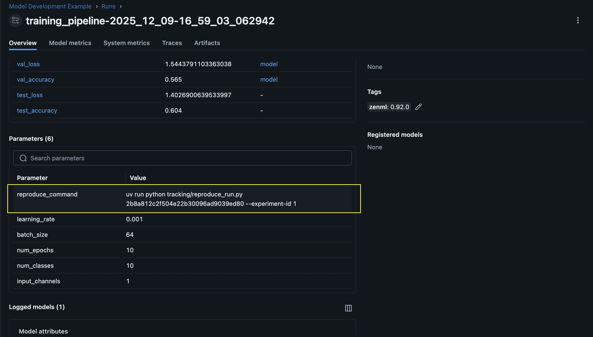

# VIN OCR Training Suite

Standalone VIN OCR pipeline built on ZenML + MLflow. Includes dataset fetching,
preprocessing, and configurable training hooks for PaddleOCR, DeepSeek OCR, and
LiquidAI LFM2.5-VL-1.6B.

## VIN OCR Quick Start

1) Install dependencies

```bash
pip install -r vin_ocr/requirements-cpu.txt
```

For GPU training, use:

```bash
pip install -r vin_ocr/requirements-gpu.txt
```

2) Fetch data from DagsHub

```bash
python vin_ocr/tools/dagshub_fetch.py \
    --repo-url https://dagshub.com/Thundastormgod/jlr-vin-ocr \
    --repo-data-path data \
    --output-dir vin_ocr_data/raw \
    --clone-dir vin_ocr_data/.dagshub_repo \
    --clean
```

3) Run the VIN OCR pipeline

```bash
python run_vin_ocr.py --fetch-from-dagshub
```

See vin_ocr/README.md for configuration details.

---

# 🖼️ Experiment In Computer Vision (Legacy)

Frictionless experiment tracking for computer‑vision research with DVC, MLflow, and ZenML. Ready to adapt to your own datasets and models.

**Cook Time:** ~30 minutes

## 🥗 Ingredients

- **Data versioning**: [DVC](https://dvc.org/)
- **Experiment tracking**: [MLflow](https://mlflow.org/)
- **Pipeline orchestrator**: [ZenML](https://www.zenml.io/)
- **Code versioning**: Git

## 🗄️ Project Structure

```
.
├── run.py               # Entry point to train/evaluate
├── steps/               # ZenML steps (data loading, training, eval)
├── pipelines/           # Pipeline definitions
├── model/               # Model code (e.g., CNN)
├── data/                # Created by make targets (train/test, rgb/grayscale)
└── Makefile             # Dataset fetch helpers
```

## ✅ Prerequisites

- Python 3.13+ with `uv` and `make`

## 🚀 Quick Start

1) Install deps and activate the venv

```bash
uv sync
source .venv/bin/activate
```

2) Fetch grayscale Simpsons-MNIST (sparse checkout into `data/train` and `data/test`)

```bash
make get-grayscale-data
```

3) Version the data with DVC (run here; `--subdir` because the repo root is git-tracked)

```bash
dvc init --subdir
dvc remote add -d myremote /tmp/dvcstore   # swap for S3/Blob as needed
dvc add data
dvc push

git add .
git commit -m "Add first version of data"
git push
```

4) Start MLflow

```bash
mlflow server --app-name basic-auth --backend-store-uri sqlite:///mlflow.db --port 5000
```

5) Point ZenML at MLflow

```bash
source .venv/bin/activate
export OBJC_DISABLE_INITIALIZE_FORK_SAFETY=YES # This is required if you are on a Mac # spellchecker:disable-line
zenml login --local
```

```bash
zenml experiment-tracker register mlflow_experiment_tracker \
    --flavor=mlflow \
    --tracking_uri=http://localhost:5000 \
    --tracking_username="admin" --tracking_password="password1234"

zenml stack register \
    -e mlflow_experiment_tracker experiment-computer-vision \
    -a default \
    -o default \
    --set
```

6) Run an experiment

```bash
python run.py
```

You should see an experiment run on the MLflow dashboard.

## 🎨 Iterating with RGB data

1) Pull RGB data (lands in `data/rgb-train` and `data/rgb-test`)

```bash
make get-rgb-data
```

2) Switch the data loader to RGB in `steps/data_loader.py` (use `Image.convert("RGB")` and 3-channel normalisation)

3) Log changes in `LOGBOOK.md` (e.g., model tweaks, dataset versions)

4) Version and push the new data

```bash
dvc add data
dvc push

git add .
git commit -m "New data version, RGB images"
git push
```

5) Run again and compare in MLflow

```bash
python run.py
```

## 🔁 Reproducing an old experiment

Use the reproduce command saved with the MLflow run (captures exact code and data). After running it:



```bash
python run.py
```

to rerun with the recovered state.

## 💻 Helpful Make targets

- `make get-grayscale-data` — fetch grayscale train/test via sparse checkout
- `make get-rgb-data` — fetch RGB train/test via sparse checkout
- `make clean-data` — remove the temporary sparse checkout directory

## VIN OCR pipeline

This project also includes a VIN OCR training pipeline that can orchestrate
PaddleOCR, DeepSeek OCR, and LiquidAI training via configurable commands.

Quick run:

```bash
python run_vin_ocr.py --fetch-from-dagshub
```

See vin_ocr/README.md for configuration details.
